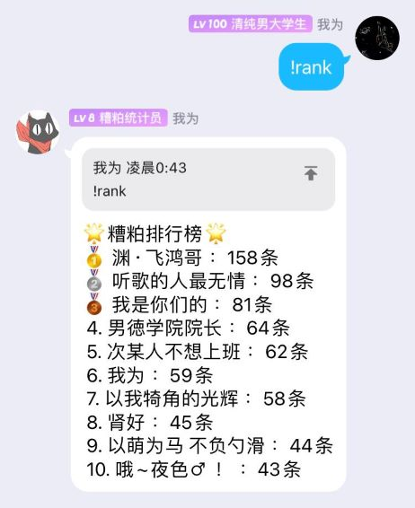

# yuan-bot
 
一个基于 [oicq](https://github.com/takayama-lily/oicq) 并使用TS编写以及使用MongoDB作为数据库的QQ机器人。

目前只针对Q群的精华数据，在此之后会陆续丰富其他功能

## 启动
在项目根目录添加config.ts并进行账号（account），密码（password）以及群号（qNumber）的配置。

> pnpm install

> pnpm run serve

## License
[MIT License](https://github.com/Magren0321/yuan-bot/blob/main/LICENSE) © 2022-PRESENT [Magren](https://github.com/Magren0321)
